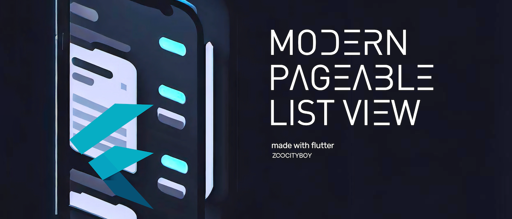

[![zoocityboy][logo_white]][zoocityboy_link_dark]
[![zoocityboy][logo_black]][zoocityboy_link_light]

Developed by 🦏 [zoocityboy][zoocityboy_link]

[![License: MIT][license_badge]][license_badge_link]
[![style: zoo lints][badge]][badge_link]

Sample repository with basic implementation of Modern Pageable ListView builded on top of Bloc library

More in article on Medium.com [Modern Pageable ListView](https://medium.com/@zoocityboy/modern-pageable-list-view-for-flutter-and-cubit-792d52d4e168)

[analysis_options_yaml]: https://github.com/zoocityboy/zoo_lints/blob/main/analysis_options.yaml
[ci_badge]: https://github.com/zoocityboy/zoo_lints/workflows/ci/badge.svg
[badge]: https://img.shields.io/badge/style-zoo_lints-3EB489.svg
[badge_link]: https://pub.dev/packages/zoo_lints
[license_badge]: https://img.shields.io/badge/license-MIT-green.svg
[license_badge_link]: https://opensource.org/licenses/MIT
[logo_black]:https://raw.githubusercontent.com/zoocityboy/zoo_brand/main/styles/README/zoocityboy_dark.png#gh-light-mode-only
[logo_white]: https://raw.githubusercontent.com/zoocityboy/zoo_brand/main/styles/README/zoocityboy_light.png#gh-dark-mode-only
[zoo_lints_link]: https://github.com/zoocityboy/zoo_lints/
[pub_badge]: https://img.shields.io/pub/v/zoo_lints.svg
[pub_badge_link]: https://pub.dartlang.org/packages/zoo_lints
[zoocityboy_link]: https://github.com/zoocityboy
[zoocityboy_link_dark]: https://github.com/zoocityboy#gh-dark-mode-only
[zoocityboy_link_light]: https://github.com/zoocityboy#gh-light-mode-only